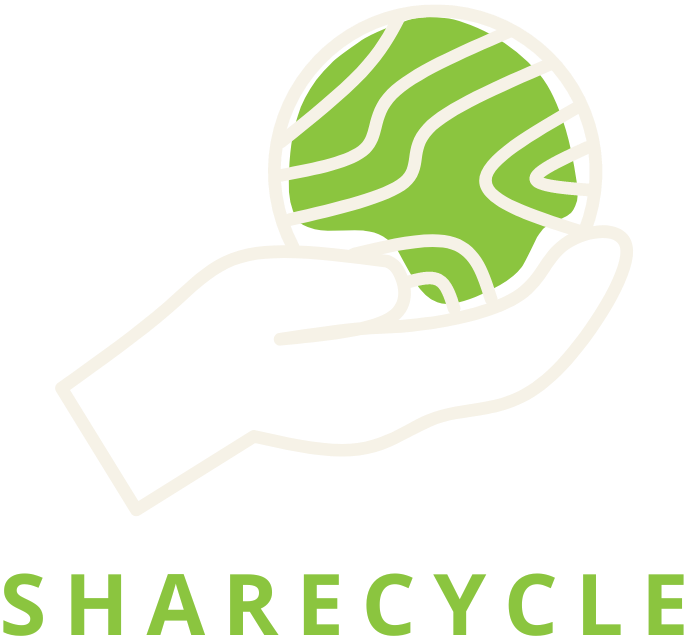

# ShareCycle: Sharing Made Easy! 🔄

 
  

    
  

 

## About ShareCycle
ShareCycle is an application that allows you to lend and borrow items with your friends. Connect with your community while helping to reduce waste and create a more sustainable future.

_The application is currently in development. Please check back later for more updates._

## Configuration
- Create an env file with your PostgreSQL database and session.
  - Example: `DATABASE_URL="INSERT_LINK"` and `SESSION_SECRET="INSERT_SESSION_KEY"`
- Run `npx prisma db seed` to test some initial data on the database with the seed file. 
- Note: `prisma generate` command will generate your Prisma schema. Must run this command when there are changes to your schema. Learn more about [Prisma]([url](https://www.prisma.io/docs/orm/prisma-client/setup-and-configuration/generating-prisma-client)https://www.prisma.io/docs/orm/prisma-client/setup-and-configuration/generating-prisma-client).

## Tech Stack
| TypeScript | React | JavaScript | TailwindCSS | PostgreSQL | Prisma | Node | Express | React Router | Jest |
|------------|-------|------------|-------------|------------|--------|------|---------|--------------|------|

